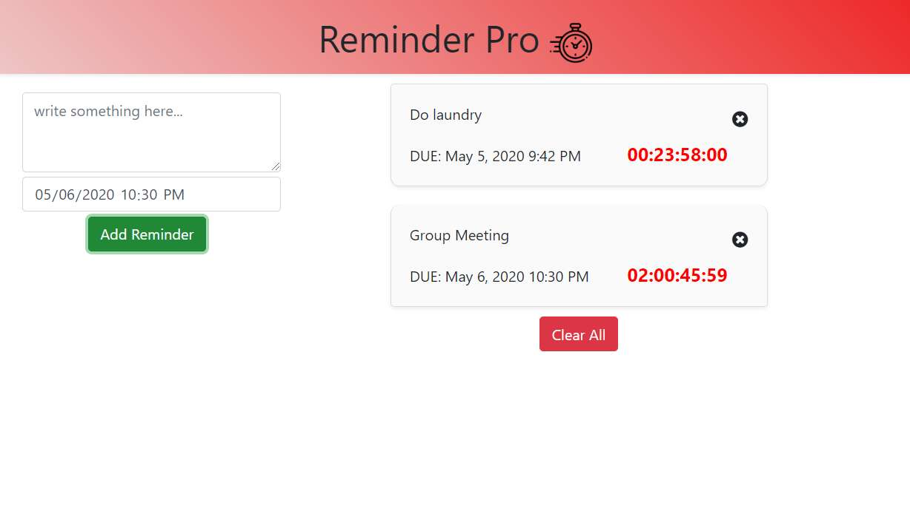

This project was bootstrapped with [Create React App](https://github.com/facebook/create-react-app).

# Reminder Pro
**An essential tool to boost your productivity!!!**

This is a powerful web reminder that lets you add to-do items with specific deadlines, and it will display the remaining time countdown as each second passes by.

## Preview


## Installation
- In your terminal, type ```git clone https://github.com/tzhang-SSR/reminderPro.git``` and hit enter
- cd into the directory you just created
- Type ```npm install``` to install all dependencies
- Type ```npm run dev``` to run the app locally

- To look at the code, just open up the project in your favorite code editor!
